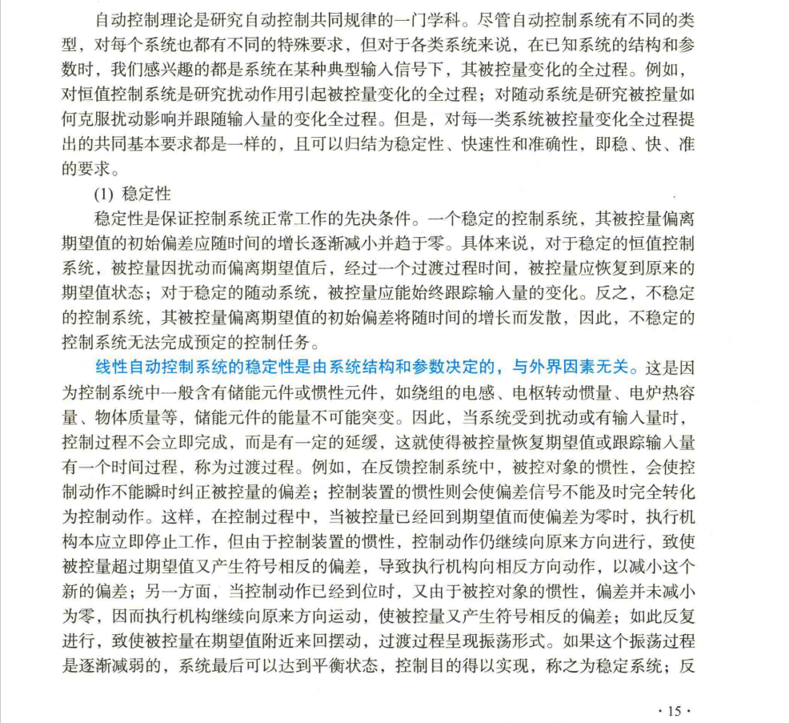
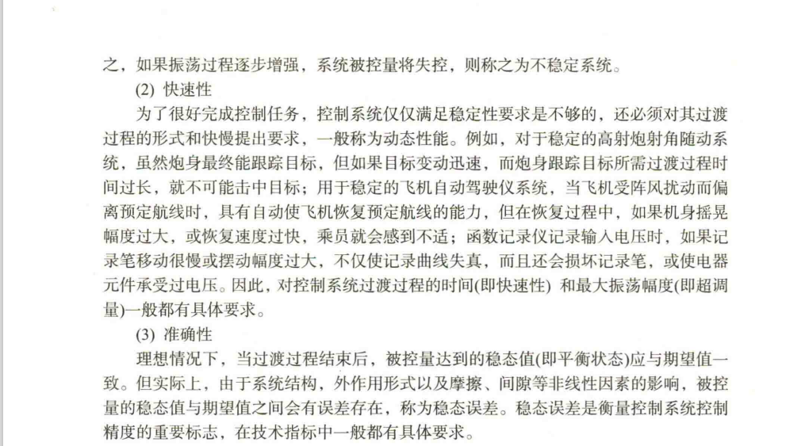
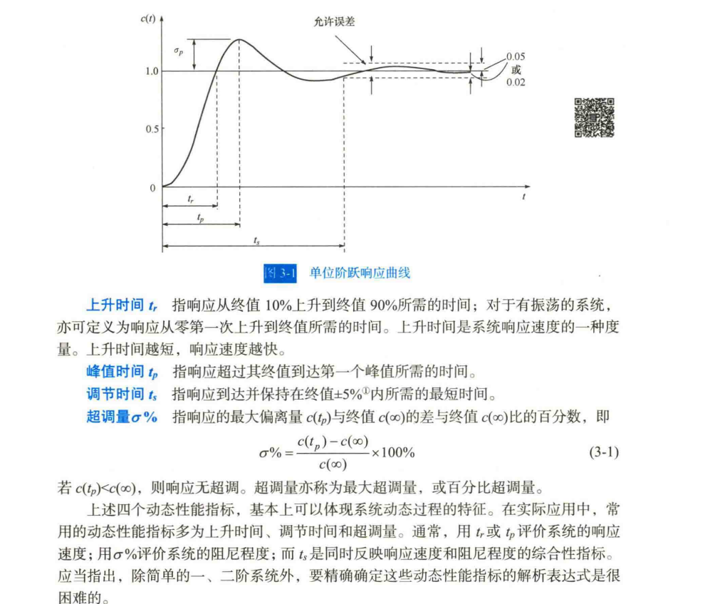

## Chapter 1 基本控制算法-PID
## 本章内容均为考核内容
### 0. 写在前面

0. ##**务必先确认与章节文件夹并列的README文件中的考核范围，自查内容，实践内容和可选任务不在检查范围内**##
1. ***善用gpt，搜索引擎与开源社区解决问题。***
2. 本次任务不设具体评分标准，为培养成员能力所用，但要求基础任务必须全部认真完成，提到的要点必须搞懂（都是基础内容）。  
   

### 自查内容：
1. 编写配置过程中的学习笔记（可以是配置过程也可以是知识点）,形式可以是独立文件也可以以注释的形式内嵌于代码中，用于日后修改代码或重配环境使用，养成记录知识分享知识好习惯。
2. 运行你的代码，展示控制结果（展示工作量），置于实验报告内。
3. 根据你的代码结构，具体流程，结果分析，调参过程编写一份实验报告，字数不限。不写也行，但要有完整的思维过程。  
   示例结构：
   1. 实验目的：需求分析（功能），  
   2. 实验内容：概要分析（设计思路与结构定义/系统模块），详细内容，  
   3. 实验结果：调试过程，测试结果，运行实现  
   4. 实验结论。
4. 分享你的感悟，可以是学习到的知识与方法论，也可以是可能有更优秀效果的新方法，或优化生产过程的好软件，可以于笔记结合


### 1. 任务1 · 搭建c/c++编译环境

- 要求，完成c/c++编译

可以选择在windows/ubuntu系统完成  
安装vscode，或终端使用cmake或g++，  
也可以选择codeblocks（易配置），clion等集成开发环境

下面列举部分使用说明

#### 1. 使用vscode编译
- 安装vscode，获取c编译器（如按照vscode官网推荐配置安装配置msys2）
- 安装 c/c++，code runner等插件
- pso.cpp 中1，2，4行添加注释
```c
1// extern "C" // C++中调用C语言函数
2// {
3#include "PID.h"
4// }
```
- 转到'运行与调试'，  
- windows使用‘C/C++: g++.exe 生成活动文件’运行（可调试），  
- linux使用‘C/C++: g++ 生成活动文件’运行（可调试）。

#### 2. 终端输入g++命令
cd 到项目目录
```sh
g++ -g src/* -o pso 
```
#### 3. 使用cmake编译

- pso.cpp 中1，2，4行去除注释
```c
extern "C" // C++中调用C语言函数

#include "PID.h"

```
终端输入
```sh
cd ~/.../pid_pso_test 
mkdir build
cd build
# make clean
cmake ..
make
```

编译完成文件为`build/pid_pso`, 在终端输入`./pid_pso`（运行当前目录的pid_pso程序）运行。

### 2. 任务2 · 了解项目基本架构

搜索资料了解C/C++项目基本架构及原因（本项目将源文件与头文件混合是为了vscode调试的便利）

向gpt询问C++项目的基本架构的回答：

一个典型的C/C++项目通常由多个文件和目录组成，每个文件和目录都有特定的用途。以下是一个基本的C++项目架构的示例，以及每个部分的解释：

#### 目录结构

```
MyCppProject/
├── CMakeLists.txt
├── README.md
├── include/
│   ├── MyClass.h
│   └── Utils.h
├── src/
│   ├── main.cpp
│   ├── MyClass.cpp
│   └── Utils.cpp
├── tests/
│   ├── CMakeLists.txt
│   └── test_MyClass.cpp
└── build/
```

#### 目录和文件解释

1. **根目录**：
   - `CMakeLists.txt`：CMake构建系统的配置文件，定义了如何构建项目。
   - `README.md`：项目的说明文件，通常包含项目简介、安装和使用说明。
   - `build/`：构建目录，存放生成的二进制文件和中间文件。

2. **include/**：
   - 存放头文件（.h 或 .hpp），这些文件声明了类、函数和变量的接口。
   - `MyClass.h`：声明 `MyClass` 类。
   - `Utils.h`：声明一些实用函数。

3. **src/**：
   - 存放源文件（.cpp），这些文件实现了头文件中声明的类和函数。
   - `main.cpp`：项目的入口点，包含 `main` 函数。
   - `MyClass.cpp`：实现 `MyClass` 类。
   - `Utils.cpp`：实现实用函数。

4. **tests/**：
   - 存放测试代码，通常使用单元测试框架（如 Google Test）。
   - `CMakeLists.txt`：测试目录的CMake配置文件。
   - `test_MyClass.cpp`：测试 `MyClass` 类的单元测试。

#### 示例文件内容

##### CMakeLists.txt（根目录）

```cmake
cmake_minimum_required(VERSION 3.10)
project(MyCppProject)

set(CMAKE_CXX_STANDARD 11)

include_directories(include)

add_executable(MyCppProject src/main.cpp src/MyClass.cpp src/Utils.cpp)

enable_testing()
add_subdirectory(tests)
```

##### include/MyClass.h

```cpp
#ifndef MYCLASS_H
#define MYCLASS_H

class MyClass {
public:
    MyClass();
    void doSomething();
};

#endif // MYCLASS_H
```

##### src/MyClass.cpp

```cpp
#include "MyClass.h"
#include <iostream>

MyClass::MyClass() {
    // Constructor implementation
}

void MyClass::doSomething() {
    std::cout << "Doing something!" << std::endl;
}
```

##### src/main.cpp

```cpp
#include "MyClass.h"

int main() {
    MyClass myClass;
    myClass.doSomething();
    return 0;
}
```

##### tests/CMakeLists.txt

```cmake
add_executable(test_MyClass test_MyClass.cpp)
target_link_libraries(test_MyClass gtest gtest_main)
add_test(NAME test_MyClass COMMAND test_MyClass)
```

##### tests/test_MyClass.cpp

```cpp
#include <gtest/gtest.h>
#include "MyClass.h"

TEST(MyClassTest, DoSomething) {
    MyClass myClass;
    myClass.doSomething();
    // Add assertions here
}

int main(int argc, char **argv) {
    ::testing::InitGoogleTest(&argc, argv);
    return RUN_ALL_TESTS();
}
```

#### 解释

1. **CMakeLists.txt**：
   - 定义了项目名称和C++标准。
   - 包含头文件目录。
   - 指定了可执行文件及其源文件。
   - 启用测试并添加测试子目录。

2. **include/MyClass.h**：
   - 声明了 `MyClass` 类及其成员函数。

3. **src/MyClass.cpp**：
   - 实现了 `MyClass` 类的构造函数和成员函数。

4. **src/main.cpp**：
   - 项目的入口点，创建 `MyClass` 对象并调用其成员函数。

5. **tests/CMakeLists.txt**：
   - 定义了测试可执行文件及其源文件。
   - 链接Google Test库。
   - 添加测试。

6. **tests/test_MyClass.cpp**：
   - 使用Google Test框架编写的单元测试，测试 `MyClass` 类的功能。

通过这种结构，可以清晰地组织C++项目的代码和资源，便于开发、维护和扩展。

### 3. 任务3 · 编写pid程序
#### 基本要求
- 稳定性， 快速性， 准确性。


#### 动态性能

#### 稳态性能
若时间趋于无穷时，系统的输出量不等于输入量或输入量的确定函数，则系统存在稳态误差。  
稳态误差是系统精度或抗扰动能力的一种度量。  
#### 尝试编写pid程序，并根据以上要求调整程序和参数
标准实现见参考资料或上网搜索/AI

更改项目结构为标准结构，使用cmake编译运行

需要编写程序为PID.c,PID.h。  
需要运行的主程序为pso.cpp  
pso.cpp 为主程序  调用了 pid.c 中的函数，所有调用位于---PID---与-PIDEND-之间  
主程序18行 定义了物体运动参数，尝试自行调整

可更改的接口 pso.cpp 43-81

要求如下：
- 试着调整PID参数，使得位置始终在TARGET+-0.1/0.05/···之间，最终稳定在TARGET位置
- 优化pid程序，如在基础程式上加入积分分离功能
- 在不同物体运动参数（外力与目标位置）下使输出达到综合最佳

重要说明：
- **粒子群优化算法给出的得分仅供参考，实际效果以输出位置稳定性准确性快速性为准。**
- **模拟的输出不完全代表实际上机控制效果，此处仅为解释PID原理及体验调参过程所用。**

pso.cpp中关于pid.c的相关接口及任务提示
（也可以尝试用c++重写pid.c与pid.h，使用面向对象的思想构建一个简单的pid类，实现pid.cpp并调用，  
了解c++中的简单方法，为ros2（对于后续的控制任务而言使用C++而不是python编写ros2代码）等后续任务理解代码做铺垫）
```c
#define PSO_ADD_ACC 1.5          // 对物体施加外力
#define TARGET 10                // 目标位置
//-----------------------------------PID-----------------------------------
// 
// 运行程序，输出位置在(TARGET+0.2) +-0.3来回运动，找出无法稳定在TARGET位置的原因(分析"+0.2"与"+-0.3"成因)
// 在首次到达目标后，位置11.1，出现了超调，如何解决超调问题
// 给出解决方案：更改示例pid.c与pid.h文件，引入积分与微分项，
// 试着调整PID参数，使得位置限制在TARGET+-0.1/0.05/···之间，最终稳定在TARGET位置
// 还有没有更佳的解决方案？

// 定义PID初始化
void Get_PID_Init(PID *pid)
{
    // 定义初始PID参数
    // 比例系数kp = 10，最大输出为1
    PID_Init(pid, 5, 1); // 调用PID.h中函数
}

// 定义PID计算
PSOState Get_PID_Calc(PID *pid, float reference, float feedback)
{
    PSOState state;
    PID_Calc(pid, reference, feedback);// 调用PID.h中函数
    // 将返回的速度输出赋给state（state.velocity = 。。。)
    state.velocity = pid->output;
    return state;
}

// 设置PID参数
void Set_PID_Gains(PID *pid, float kp, float ki, float kd)
{
    // 设置PID参数
    PID_SetGains(pid, kp, ki, kd);// 调用PID.h函数
}

// 打印PID信息
void Print_PID_Update_Info(PID *pid)
{
    printf("kp: %f\n", pid->kp);//输出
}

// 输出效果评定
// 1. 目测法
// 2. score: 2617.433594 score = 与目标距离平方和，在除pid参数其他不变情况下 越小越好

//-----------------------------------PIDEND-----------------------------------

```

最终效果参考（终端输出）：

``` txt
Kp=0.865803
Ki=0.349081
Kd=0.111664

POS_DELTA_T: 0.500000, PSO_ADD_ACC: 1.500000, PSO_MAX_ACCELERATION: 5.000000, PSO_MAX_VELOCITY: 2.000000
time: 0.00, position: 0.000000, control: 2.000000, error: 5.000000
tar: +5.000000 mea:+0.000000 err:+5.000000 P: +2.164509 I: +1.000000 D: +1.674963 Out:4.839472 _MAX:2.000000
time: 0.50, position: 1.375000, control: 2.000000, error: 3.625000
tar: +5.000000 mea:+0.000000 err:+5.000000 P: +2.164509 I: +1.000000 D: +1.674963 Out:4.839472 _MAX:2.000000
time: 1.00, position: 2.750000, control: 2.000000, error: 2.250000
tar: +5.000000 mea:+1.375000 err:+3.625000 P: +1.569269 I: +1.000000 D: -0.403038 Out:2.166231 _MAX:2.000000
time: 1.50, position: 4.125000, control: 1.908462, error: 0.875000
tar: +5.000000 mea:+2.750000 err:+2.250000 P: +1.298705 I: +1.000000 D: -0.390243 Out:1.908462 _MAX:2.000000
time: 2.00, position: 5.454231, control: 1.481857, error: -0.454231
tar: +5.000000 mea:+4.125000 err:+0.875000 P: +0.804927 I: +1.000000 D: -0.323070 Out:1.481857 _MAX:2.000000
time: 2.50, position: 6.570159, control: -0.771410, error: -1.570159
tar: +5.000000 mea:+5.454231 err:-0.454231 P: -0.524238 I: +0.000000 D: -0.247172 Out:-0.771410 _MAX:2.000000
time: 3.00, position: 6.559454, control: -2.000000, error: -1.559454
tar: +5.000000 mea:+6.570159 err:-1.570159 P: -1.965286 I: -0.151923 D: -0.180591 Out:-2.297801 _MAX:2.000000
time: 3.50, position: 5.934454, control: -2.000000, error: -0.934454
tar: +5.000000 mea:+6.559454 err:-1.559454 P: -1.650312 I: -0.363607 D: +0.001459 Out:-2.012460 _MAX:2.000000
time: 4.00, position: 5.309454, control: -1.276929, error: -0.309454
tar: +5.000000 mea:+5.934454 err:-0.934454 P: -0.868260 I: -0.514771 D: +0.106102 Out:-1.276929 _MAX:2.000000
time: 4.50, position: 5.045990, control: -0.704193, error: -0.045990
tar: +5.000000 mea:+5.309454 err:-0.309454 P: -0.246791 I: -0.573044 D: +0.115642 Out:-0.704193 _MAX:2.000000
time: 5.00, position: 5.068893, control: -0.570538, error: -0.068893
tar: +5.000000 mea:+5.045990 err:-0.045990 P: -0.037653 I: -0.581508 D: +0.048623 Out:-0.570538 _MAX:2.000000
time: 5.50, position: 5.158624, control: -0.658455, error: -0.158624
tar: +5.000000 mea:+5.068893 err:-0.068893 P: -0.061017 I: -0.593264 D: -0.004174 Out:-0.658455 _MAX:2.000000
time: 6.00, position: 5.204397, control: -0.781148, error: -0.204397
tar: +5.000000 mea:+5.158624 err:-0.158624 P: -0.145864 I: -0.619379 D: -0.015905 Out:-0.781148 _MAX:2.000000
time: 6.50, position: 5.188823, control: -0.848980, error: -0.188823
tar: +5.000000 mea:+5.204397 err:-0.204397 P: -0.188035 I: -0.652948 D: -0.007996 Out:-0.848980 _MAX:2.000000
time: 7.00, position: 5.139333, control: -0.852304, error: -0.139333
tar: +5.000000 mea:+5.188823 err:-0.188823 P: -0.170564 I: -0.684478 D: +0.002738 Out:-0.852304 _MAX:2.000000
time: 7.50, position: 5.088180, control: -0.822741, error: -0.088180
tar: +5.000000 mea:+5.139333 err:-0.139333 P: -0.123344 I: -0.708251 D: +0.008854 Out:-0.822741 _MAX:2.000000
time: 8.00, position: 5.051810, control: -0.791266, error: -0.051810
tar: +5.000000 mea:+5.088181 err:-0.088181 P: -0.077054 I: -0.723500 D: +0.009287 Out:-0.791266 _MAX:2.000000
time: 8.50, position: 5.031177, control: -0.770868, error: -0.031177
tar: +5.000000 mea:+5.051810 err:-0.051810 P: -0.045030 I: -0.732508 D: +0.006669 Out:-0.770868 _MAX:2.000000
time: 9.00, position: 5.020742, control: -0.761194, error: -0.020742
tar: +5.000000 mea:+5.031177 err:-0.031177 P: -0.027064 I: -0.737935 D: +0.003805 Out:-0.761194 _MAX:2.000000
time: 9.50, position: 5.015146, control: -0.757621, error: -0.015146
tar: +5.000000 mea:+5.020742 err:-0.020742 P: -0.018005 I: -0.741546 D: +0.001930 Out:-0.757621 _MAX:2.000000
time: 10.00, position: 5.011335, control: -0.756291, error: -0.011335
tar: +5.000000 mea:+5.015146 err:-0.015146 P: -0.013145 I: -0.744183 D: +0.001037 Out:-0.756291 _MAX:2.000000
time: 10.50, position: 5.008190, control: -0.755283, error: -0.008190
tar: +5.000000 mea:+5.011335 err:-0.011335 P: -0.009832 I: -0.746158 D: +0.000707 Out:-0.755283 _MAX:2.000000
time: 11.00, position: 5.005548, control: -0.754101, error: -0.005548
tar: +5.000000 mea:+5.008190 err:-0.008190 P: -0.007100 I: -0.747586 D: +0.000584 Out:-0.754101 _MAX:2.000000
time: 11.50, position: 5.003497, control: -0.752869, error: -0.003497
tar: +5.000000 mea:+5.005548 err:-0.005548 P: -0.004807 I: -0.748553 D: +0.000491 Out:-0.752869 _MAX:2.000000
time: 12.00, position: 5.002063, control: -0.751811, error: -0.002063
tar: +5.000000 mea:+5.003497 err:-0.003497 P: -0.003029 I: -0.749163 D: +0.000381 Out:-0.751811 _MAX:2.000000
time: 12.50, position: 5.001157, control: -0.751043, error: -0.001157
tar: +5.000000 mea:+5.002063 err:-0.002063 P: -0.001786 I: -0.749523 D: +0.000267 Out:-0.751043 _MAX:2.000000
time: 13.00, position: 5.000636, control: -0.750559, error: -0.000636
tar: +5.000000 mea:+5.001157 err:-0.001157 P: -0.001002 I: -0.749725 D: +0.000168 Out:-0.750559 _MAX:2.000000
time: 13.50, position: 5.000356, control: -0.750290, error: -0.000356
tar: +5.000000 mea:+5.000636 err:-0.000636 P: -0.000550 I: -0.749836 D: +0.000097 Out:-0.750290 _MAX:2.000000
time: 14.00, position: 5.000211, control: -0.750155, error: -0.000211
tar: +5.000000 mea:+5.000356 err:-0.000356 P: -0.000308 I: -0.749898 D: +0.000052 Out:-0.750155 _MAX:2.000000
time: 14.50, position: 5.000134, control: -0.750091, error: -0.000134
tar: +5.000000 mea:+5.000211 err:-0.000211 P: -0.000183 I: -0.749935 D: +0.000027 Out:-0.750091 _MAX:2.000000
time: 15.00, position: 5.000088, control: -0.750060, error: -0.000088
tar: +5.000000 mea:+5.000134 err:-0.000134 P: -0.000116 I: -0.749959 D: +0.000014 Out:-0.750060 _MAX:2.000000
```

### 4. 可选提高任务（难度逐级递增，也可以自己寻找相关任务作为提高任务）
- 依照#ifndef TEST内容使用粒子群优化算法优化参数（更新kp，ki，kd参数），如果pid算法无误但评分始终不佳可以更改适应度计算函数评分标准以达到更佳效果

- 从头构建pid程序（源文件与头文件），CMakeList.txt，体验多文件程序实现的方法与注意点，完成你自己的pid标准库。  
  如#ifndef \_A\_ 避免重复连接， 如何组织程序结构（防止循环定义）编写include "" 才能完成生成 

- 依照#ifndef TEST内容使用模糊控制（自适应pid的一种实现），需要动态更新kp，ki，kd（pid程序参数逐级更改），尝试理解代码。  
  c语言代码位于参考资料/fuzzypid_c，尝试修复代码并调用。

- 尝试pid自整定（搜索网上资料），未完成示例位于参考资料/autotune/*（网上抄的，跑出来效果不佳）
  
- ······