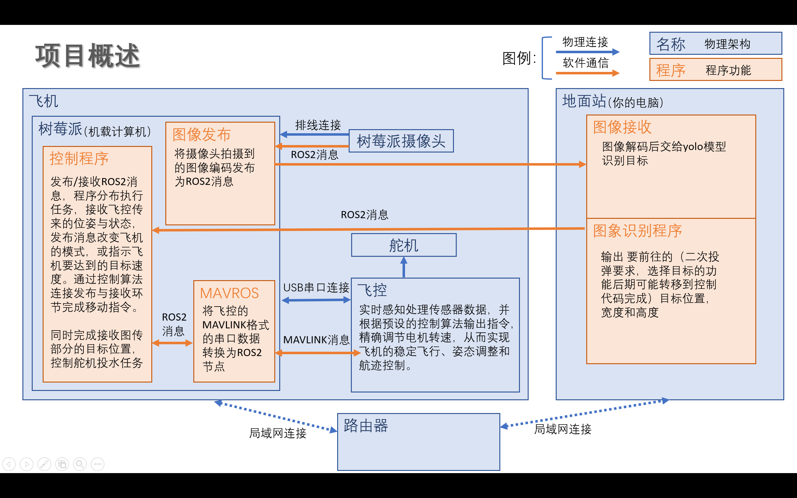
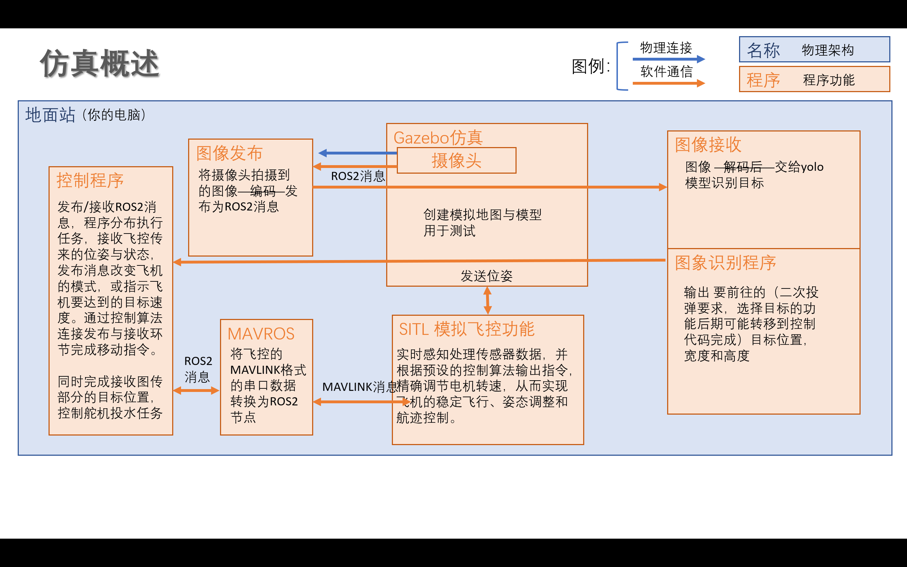
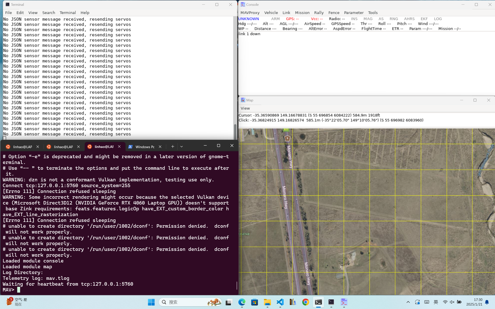
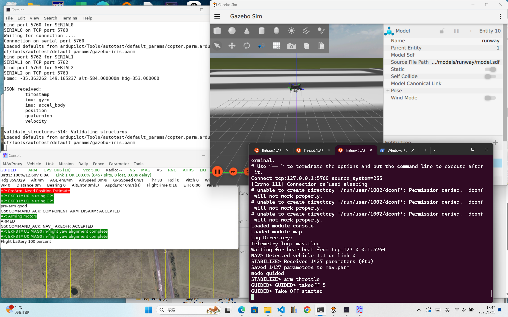

## Chapter3_仿真环境配置-APM-SITL&Gazebo
### 0. 写在前面
0. ##**务必先确认与章节文件夹并列的README文件中的考核范围，自查内容不检查**##

了解比赛规则和项目大致流程

当前内容为下部分构建项目的基础  
要求全部学习完成  
任务：写笔记记录你的安装过程

### 0. 需求分析 不考核
比赛规则位于  
Chapter5_编写无人机控制代码\2024中国大学生飞行器设计创新大赛竞赛规则(1).pdf  
自动控制无人机完成侦察与投弹任务  


### 1. 项目概述
当前项目架构：  
无人机使用Ardupilot飞控，通过串口连接到树莓派。 

控制部分：树莓派中运行控制代码，发布ros2消息，通过mavros桥接转换为mavlink协议通过串口与飞控通信实现实行控制。    

图像识别部分：树莓派读取树莓派摄像头的数据，发布ros2消息到以太网，地面站（你的计算机）接收ros2消息，通过yolo识别出对象的宽高与位置，再通过ros2发布由树莓派上的控制程序接收，转化为飞机的目标姿态。  
```
飞机{{飞控}-串口连接-{机载计算机(树莓派)}}-以太网（ros2）-地面站{图传}  
                |missionplanner    |-ros2-摄像头
```
仿真项目架构：  
飞控改为用ardupolot-sitl模拟，安装mavros桥接，控制代码接收与发布ros2消息，  
通过gazebo观察飞机状态，输出摄像头数据。  
```
地面站{mavlink{ardupolot-sitl}-mavros-ros2{控制代码}}-ros2{图传代码}  
                                                     | gazebo获得图像数据-ros2
```
总结：
- 项目概述

- 仿真概述


### 2. 安装ardupilot仿真（即ardupilot sitl 与 mavros以及gazebo）不考核

```sh
git clone --recurse-submodules https://github.com/ArduPilot/ardupilot.git
cd ardupilot
Tools/environment_install/install-prereqs-ubuntu.sh -y
#更新子模块git submodule update --init --recursive
#重新加载路径（注销和登录以永久）：
. ~/.profile
./waf configure --board sitl
./waf copter
cd ardupilot/ArduCopter
sim_vehicle.py -w
sim_vehicle.py --console --map
#export PATH="$HOME/ardupilot/Tools/autotest:$PATH"
# sim_vehicle.py -w -v ArduCopter
# sim_vehicle.py --vehicle=ArduCopter --console --map
```

自行了解各个仿真工具的功能

如果你使用wsl2，你可以尝试[通过 Mission Planner 的模拟功能运行SITL](https://ardupilot.org/planner/docs/mission-planner-simulation.html#mission-planner-simulation)

ardupilot官网：  
https://ardupilot.org/ardupilot/

安装missionplanner：（可选，用于真机校准，可以选择在windows安装）  
https://ardupilot.org/planner/docs/mission-planner-installation.html  


仿真部分官方教程：  

https://ardupilot.org/dev/docs/ros2.html  
https://ardupilot.org/dev/docs/ros2-sitl.html  
https://ardupilot.org/dev/docs/ros2-gazebo.html  

具体流程：  

构建APM源码：  
https://ardupilot.org/dev/docs/building-the-code.html  

SITL仿真：
https://ardupilot.org/dev/docs/sitl-simulator-software-in-the-loop.html

Gazebo仿真：  
https://ardupilot.org/dev/docs/sitl-with-gazebo.html  

安装与ros2版本对应的gazebo  
https://gazebosim.org/docs/ionic/install/
https://gazebosim.org/docs/fortress/ros2_gz_vendor_pkgs/  

提示：可以尝试了解ros2与ardupilot通过dds直接连接，但目前（2024年11月）该项目开发进度尚未到可使用水平（只支持模式转换，起飞降落）

### 3. 启动仿真
#### 使用 SITL
sim_vehicle.py
提供了一个启动脚本，用于自动为当前代码分支构建 SITL 固件版本、加载仿真模型、启动仿真器、设置环境和车辆参数，以及启动 MAVProxy GCS。可以指定许多脚本启动参数，键入此参数可查看完整列表：
`sim_vehicle.py --help`(先输入`export PATH=$PATH:$HOME/ardupilot/Tools/autotest`或将该命令写入~/.bashrc自动运行)
```
#用到的列表
  -v VEHICLE, --vehicle=VEHICLE
                        vehicle type (飞行器类型选择ArduCopter四旋翼)
  -f FRAME, --frame=FRAME
                        set vehicle frame type
                        ArduCopter: gazebo-
                            iris
                        （选择机架类型：gazebo-iris）
Simulation options:
    --model=MODEL       Override simulation model to use（新开终端，与gazebo通信）
Compatibility MAVProxy options (consider using --mavproxy-args instead):
  --map               load map module on startup（新开一个map窗口显示地图）
  --console           load console module on startup （新开一个console窗口显示飞机状态）
```
```sh
#标准启动命令
sim_vehicle.py -v ArduCopter -f gazebo-iris --model JSON --map --console
```
启动完后应新开三个窗口，如图所示,左下角为原来的窗口，ubuntu系统中新开的终端与原来的终端样式一致


#### gazebo与APM SITL综合使用
- 启动gazebo
    ```bash
    gz -h

    sim:           Run and manage the Gazebo Simulator.

    gz sim -h

    -r                           Run simulation on start.
    -v [ --verbose ] [arg]       Adjust the level of console output (0~4).控制台输出的输出等级
                                The default verbosity is 1, use -v without

                                arguments for level 3.

    ```
- 构建插件省略
- 配置 Gazebo 环境
    Gazebo 使用许多环境变量来查找插件和模型 在运行时。这些可以在用于运行 Gazebo 的终端中设置，也可以设置 在 .bashrc 或 .zshrc 文件中：

    - 在终端中
        ```sh
        export GZ_SIM_SYSTEM_PLUGIN_PATH=$HOME/gz_ws/src/ardupilot_gazebo/build:$GZ_SIM_SYSTEM_PLUGIN_PATH
        export GZ_SIM_RESOURCE_PATH=$HOME/gz_ws/src/ardupilot_gazebo/models:$HOME/gz_ws/src/ardupilot_gazebo/worlds:$GZ_SIM_RESOURCE_PATH
        ```
    - 在 .bashrc 或 .zshrc 中
        ```sh
        echo 'export GZ_SIM_SYSTEM_PLUGIN_PATH=$HOME/gz_ws/src/ardupilot_gazebo/build:${GZ_SIM_SYSTEM_PLUGIN_PATH}' >> ~/.bashrc
        echo 'export GZ_SIM_RESOURCE_PATH=$HOME/gz_ws/src/ardupilot_gazebo/models:$HOME/gz_ws/src/ardupilot_gaz
        ```
综合启动

Iris quadcopter
Run Gazebo
```sh
gz sim -v4 -r iris_runway.sdf
```
Run SITL
```sh
sim_vehicle.py -v ArduCopter -f gazebo-iris --model JSON --map --console
```
给飞控发送模式切换，解锁和起飞距离起飞点5米高度命令  
Arm and takeoff
```
STABILIZE> mode guided
GUIDED> arm throttle
GUIDED> takeoff 5
```

完成起飞操作后的界面


